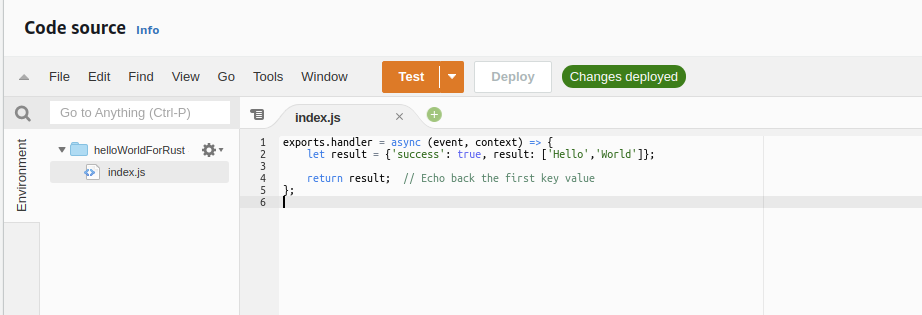
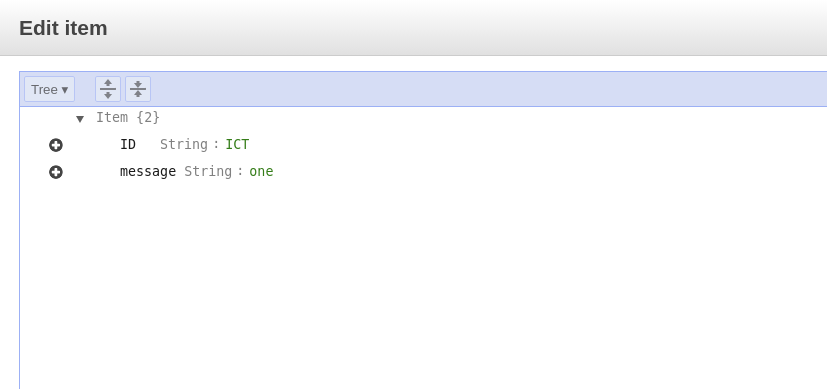

# RUST Actix-Web Microservice
----------------------------------------------------
Our Rust Beginners Kit for Application Development
---------------------------------------------------

#### A collection of sample code   using the actix rust framework to

### A) Develop REST API

#### Sample Code :
Functionality | API | Description
:---------|:--------|:--------
Post JSON data and recieve JSON data | http://0.0.0.0:9000/register_user| Recieve user details, query to create new user and respond with status of request
Post JSON data and recieve jwt token for auth |http://0.0.0.0:9000/login | Recieve username and passwrod, query and verify if credentials are correct, generate and respond with jwt
Fetch JSON Array | http://0.0.0.0:9000/view_holidays | Recieve input year, query database for holiday dates and respond with results
AWS Lambda function invoke | http://0.0.0.0:9000/lambda_example | Invoke the function synchronously
Upload to AWS S3 | http://0.0.0.0:9000/upload_file | ----
Dynamodb Query | http://0.0.0.0:9000/dynamodb_example | Simple Dynamodb Query Example

###  B) Road Map
-   ##### Integrate with Generally used  Amazon Web Services ( more coming soon )
-   ##### Integrate with Elastic Search
-   ##### Graphql

-   ##### Better Error handling

### C) Features :
-   ##### Actix Web framework
-   ##### Serde serialization framework
-   ##### Bcrypt for password hashing
-   ##### JWT token Based Authontication
-   ##### Postgres databse
-   ##### Use of Diesel ORM
-   ##### AWS Lambda, Dynamodb, S3 examples


### D) Dependencies:

Here's what does what:
Crate | Description
:---------|:--------
[actix-web](https://github.com/actix/actix-web)|Actix Web is a powerful, pragmatic, and extremely fast web framework for Rust.
[Diesel](https://diesel.rs)|Diesel is a Safe, Extensible ORM and Query Builder for Rust
[Serde](https://crates.io/crates/serde)|Serde is a framework for serializing and deserializing Rust data structures
[rusoto](https://www.rusoto.org/)| Rusoto is an AWS SDK for Rust.
[dotenv](https://crates.io/crates/dotenv)|Required for loading environment variables from .env file
[env_logger](https://crates.io/crates/env_logger)|Implements a logger that can be configured via environment variables.
[jsonwebtoken](https://crates.io/crates/jsonwebtoken)|To Create and parses JWT (JSON Web Tokens)
[http](https://crates.io/crates/http)|A general purpose library of common HTTP types
[easy_password](https://crates.io/crates/easy_password)| Simple crate for password hashing


### E) Run locally

> Before you get started, make sure that you have [PostgreSQL](https://postgresql.org), [Rust](https://rust-lang.org), [Cargo](https://doc.rust-lang.org/cargo/), and the [Diesel](https://diesel.rs) CLI installed and that you have Postgres running somewhere.

```bash
# Fetch the repo
git clone https://github.com/intelliconnect/rust-lang-apps.git


# Add environment variables to .env file.
nano .env

diesel setup
diesel migration run

cargo check
cargo run # could take a while!
```


### F) Example requests
#### 1) Register
```
curl -i --request POST \
  --url http://0.0.0.0:9000/register_user \
  --header 'content-type: application/json' \
  --data '{
        "firstname":"abc",
        "lastname":"bbq",
        "username":"admin",
        "email":"admin@gmail.com",
        "mobile":"123456789",
        "password":"1313n218u41",
        "ip_address":"124.245.55.124",
        "isactive":true
}'
```

#### 2) Login
```
curl -i --request POST \
  --url http://0.0.0.0:9000/login \
  --header 'content-type: application/json' \
  --data '{ "username":"admin","password":"1313n218u41"}'
```

#### 3) View Holidays
```
curl -i --request GET \
  --url http://0.0.0.0:9000/view_holidays \
  --header 'content-type: application/json' \
  --header 'Authorization: Bearer <token>' \
  --data '{ "year": "2020" }'
```


#### 4) AWS Lambda Invoke

```
curl -i --request GET \
--url http://0.0.0.0:9000/lambda_example \
--header 'content-type: application/json'
```
######make sure you have lambda function similar to this 




#### 5) AWS S3 Upload
######make sure you have a bucket on S3 "elastic-search-bucket-test"

```
curl -i POST \
--url http://0.0.0.0:9000/upload_file   \
--header 'content-type: multipart/form-data' \
-F "file=@image_upload_test.jpg"
```


#### 6) AWS Dynamodb Query
######make sure you have table with name "rusttest" and an item similar to this




```
curl -i --request GET \
--url http://0.0.0.0:9000/dynamodb_example \
--header 'content-type: application/json' \
--data '{"id":"ICT"}'
```
